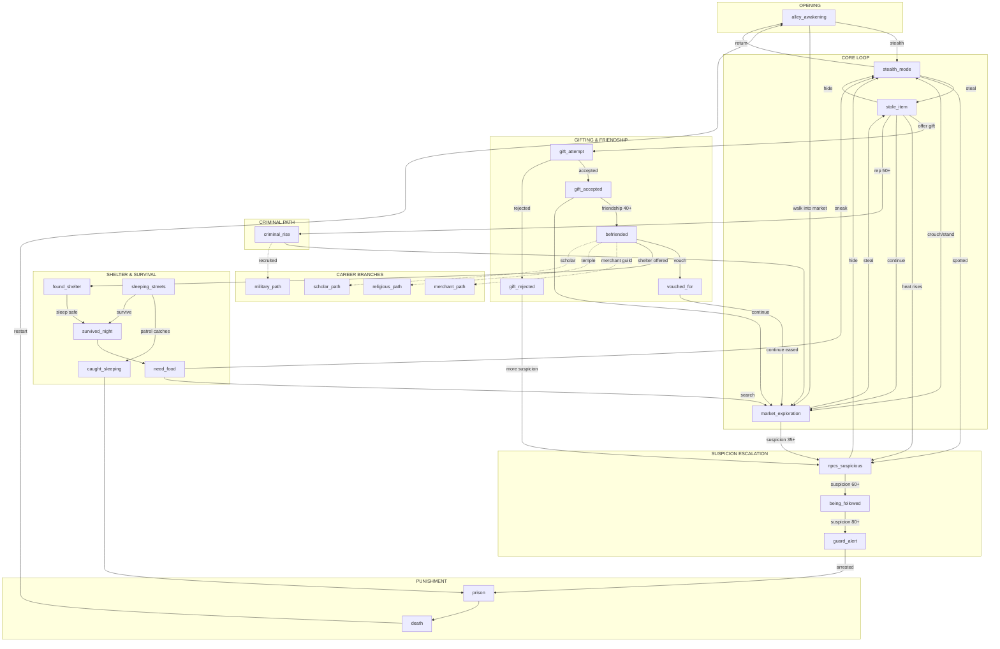
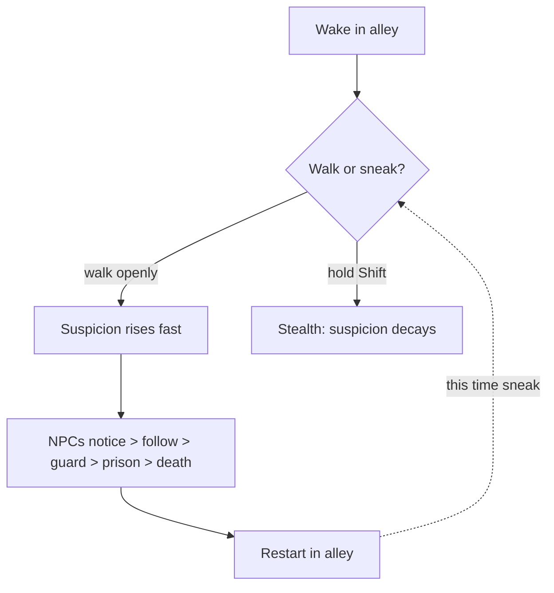
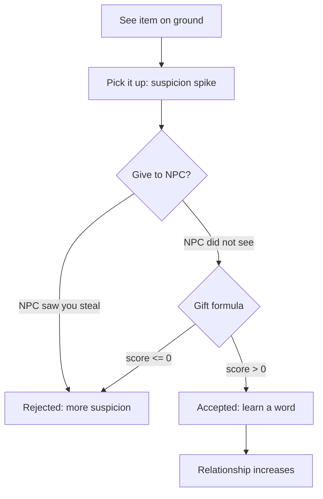
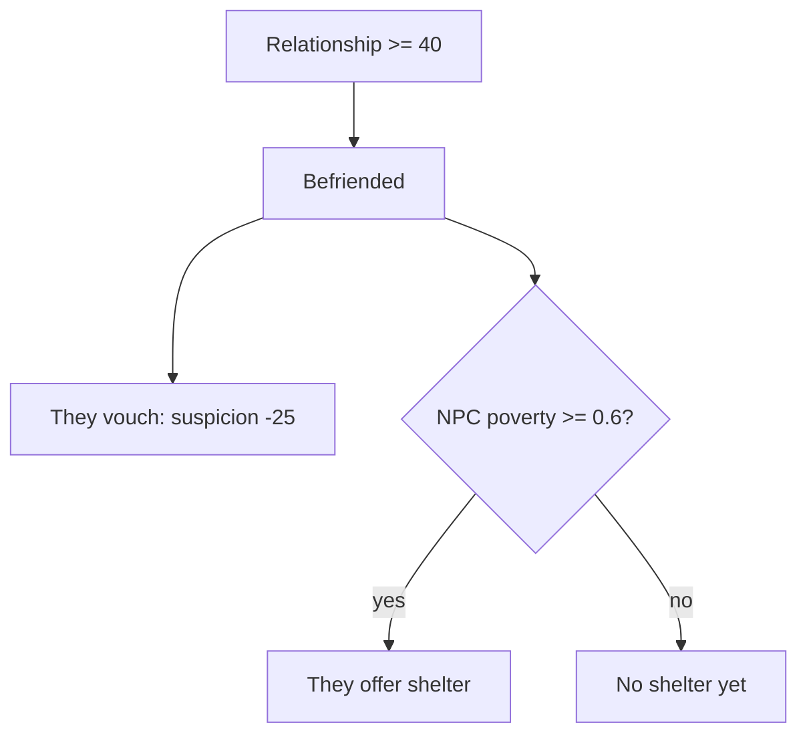
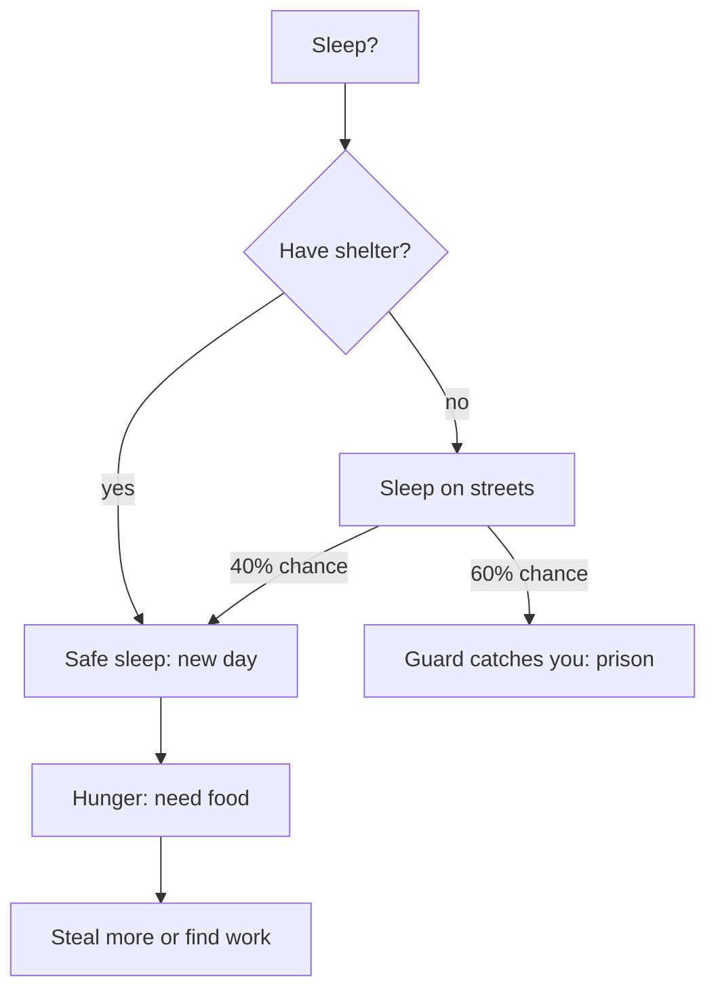
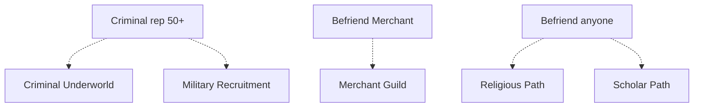

## Overview

You wake in an alley off a foreign town square market. No one speaks your language. Every moment you
spend visible in the market raises suspicion. Get caught and you die. Learn to steal, gift, befriend,
and survive, or rise through the criminal underworld.

## Story Graph



## Narrative Phases

### Phase 1: First Contact (tutorial death)

The player walks openly into the market and is quickly noticed, followed, and arrested.
They restart in the alley. This teaches them to sneak.



### Phase 2: Steal and Gift

Discover items on the ground. Picking them up spikes suspicion. Giving them to an NPC who
did not witness the theft may earn trust and a word in the foreign language.



### Phase 3: Friendship

Hit relationship 40 with an NPC and they befriend you. They vouch for you (suspicion -25).
If they are poor (poverty >= 0.6), they also offer shelter.



### Phase 4: Survival Loop

Day/night cycle of stealing food, sleeping, and avoiding patrols.
Without shelter there is a 60% chance of arrest each night.



### Phase 5: Career Branches (placeholder)

Four branching story paths. Each is a separate narrative arc that needs full design.



| Branch | Trigger | Theme |
|--------|---------|-------|
| Merchant | Befriend the Merchant NPC | Trade, negotiation, wealth |
| Military | Criminal rep 50+ (guard captain recruits) | Discipline, combat, honor |
| Religious | Befriend any NPC (priest offers sanctuary) | Faith, wisdom, devotion |
| Scholar | Befriend any NPC (librarian notices language learning) | Knowledge, language, discovery |

## Mechanics

### Suspicion meter (0 to 100)

| Threshold | Effect |
|-----------|--------|
| 0 | Safe |
| 35 | NPCs start following |
| 60 | Guard begins chase |
| 80 | Arrested |

### Suspicion rate changes

| Event | Change |
|-------|--------|
| Visible in market | +1.5/sec |
| Stealthing (Shift) | -0.5/sec |
| Steal unseen | +15 |
| Steal witnessed | +30 |
| Friend vouches | -25 |
| Survive a night | -10 |
| Gift rejected | +5 |

### Gift acceptance formula

```text
score = itemValue * (1 + poverty) - morality * stolenCount * 5
```

* score > 0: accepted, relationship increases by score, player learns foreign word
* score <= 0: rejected, suspicion +5

### NPC stats

| NPC | Morality | Poverty | Easy to gift? | Can shelter? |
|-----|----------|---------|---------------|--------------|
| Merchant | 0.3 | 0.1 | Easiest | No |
| Baker | 0.7 | 0.5 | Hard | No |
| Blacksmith | 0.5 | 0.3 | Medium | No |
| Herbalist | 0.6 | 0.7 | Medium | Yes |

### Item values

| Item | Value | Foreign word |
|------|-------|-------------|
| Bread | 10 | Khleb |
| Herb | 15 | Trava |
| Sword | 30 | Mech |
| Gold Coin | 40 | Zolota |

### Friendship

* Relationship >= 40: befriended
* Befriended + poverty >= 0.6: shelter offered
* Befriended: NPC vouches (suspicion -25)

## Controls

| Key | Action |
|-----|--------|
| WASD | Move |
| Shift (hold) | Stealth |
| E | Interact / advance dialogue |
| G | Give last item to nearest NPC |
| Q | Drop last item |
| R | Sleep (while standing still) |
| Tab | Toggle story graph debug viewer |
