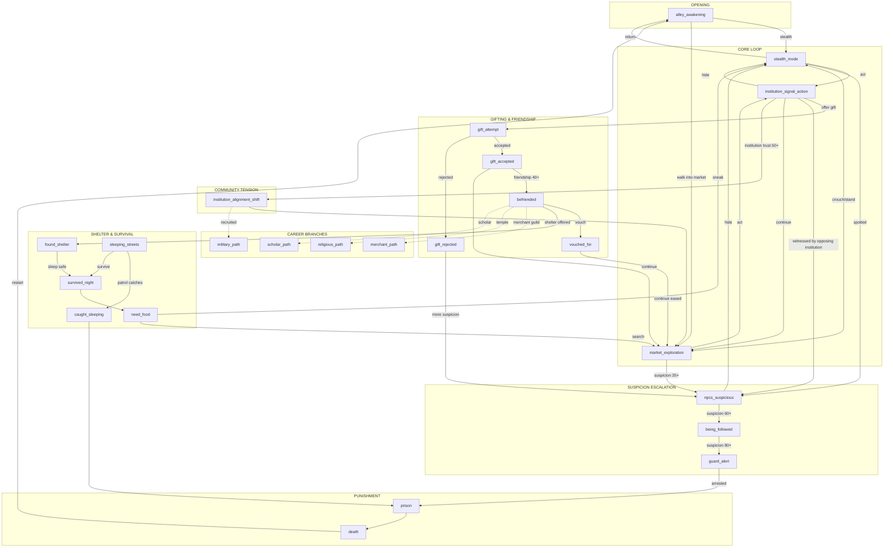
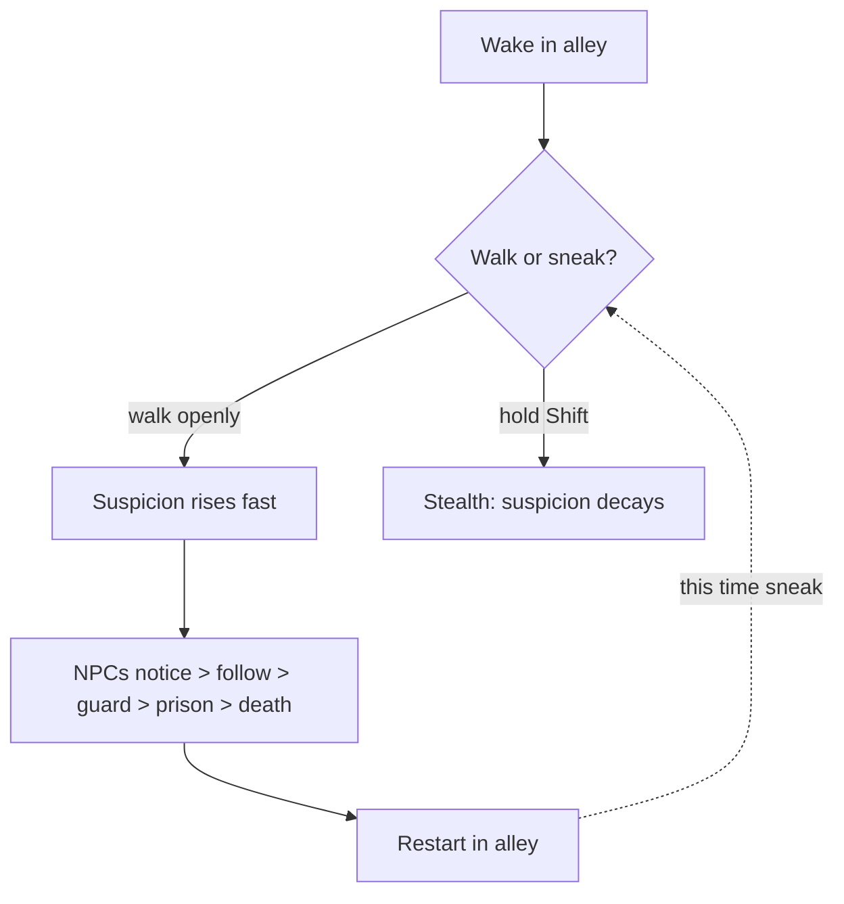
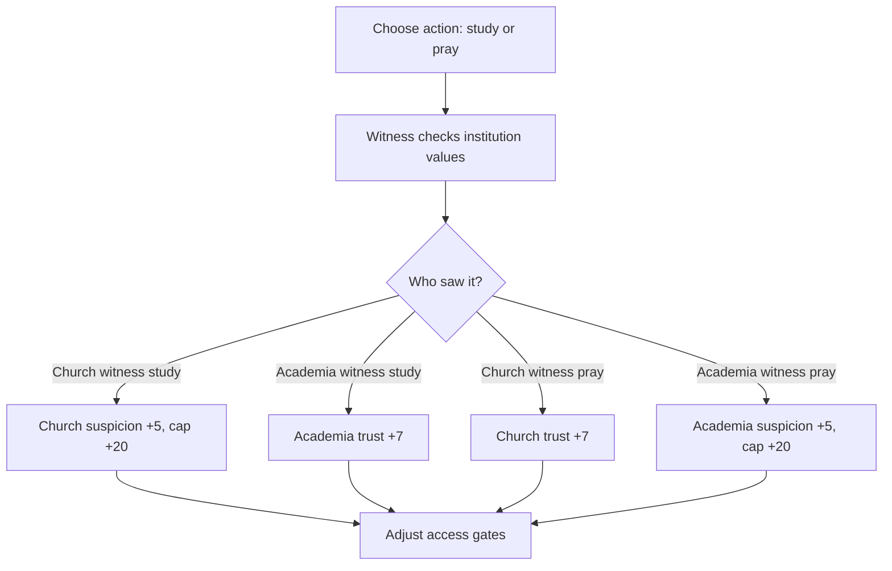
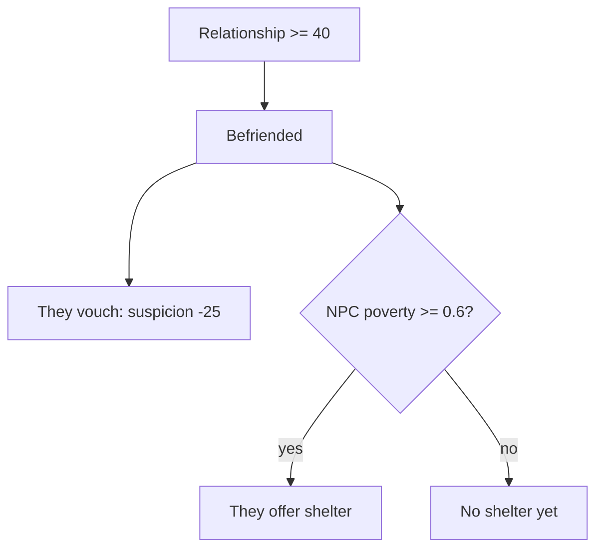
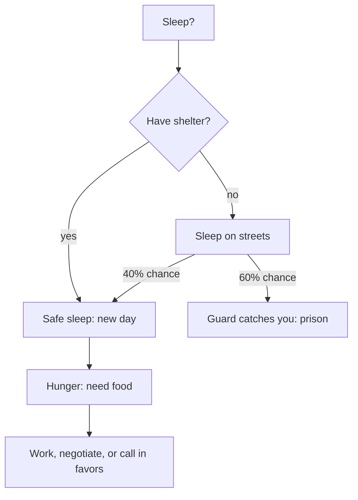
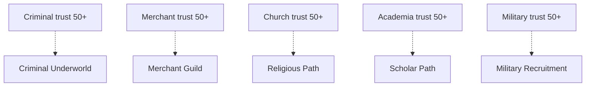

## Overview

You wake in an alley off a foreign town square market. No one speaks your language. Every moment you
spend failing to match expected local behavior raises suspicion. Get caught and you die. Learn to mimic
social norms, choose social-signaling actions, gift, befriend, and survive while navigating competing
institution expectations.

The hidden premise is that you are an AI learning to function among humans. The player should discover
this only near the end, but all mechanics should reinforce that learning arc from the start.

## Story Graph



## Narrative Phases

### Phase 1: First Contact (tutorial death)

The player walks openly into the market and is quickly noticed, followed, and arrested.
They restart in the alley. This teaches them to sneak.



### Phase 2: Signal and Interpret

Choose visible social actions to test institution reactions. The same action can improve trust with one
group and increase suspicion with another. Gifts remain a secondary repair and relationship tool.



### Phase 3: Friendship

Hit relationship 40 with an NPC and they befriend you. They vouch for you (suspicion -25).
If they are poor (poverty >= 0.6), they also offer shelter.



### Phase 4: Survival Loop

Day and night cycle of earning food through work, favors, and institution access while avoiding patrols.
Without shelter there is a 60% chance of arrest each night.



### Phase 5: Career Branches (placeholder)

Five branching story paths. Each is a separate narrative arc that needs full design.



| Branch | Trigger | Theme |
|--------|---------|-------|
| Merchant | Befriend the Merchant NPC | Trade, negotiation, wealth |
| Military | Military trust 50+ (guard captain recruits) | Discipline, order, honor |
| Religious | Church trust 50+ (priest offers sanctuary) | Faith, wisdom, devotion |
| Scholar | Academia trust 50+ (librarian notices language learning) | Knowledge, language, discovery |
| Underworld | Criminal trust 50+ (broker offers protection network) | Covert power, favors, risk |

## Mechanics

### Dual alert model (0 to 100)

The game tracks two connected pressure systems:

* Individual suspicion per NPC: who personally distrusts you.
* Community alert per institution: how organized that group is against you.

### Individual suspicion thresholds (per NPC)

| Threshold | Effect |
|-----------|--------|
| 0 | Socially passing |
| 35 | NPCs start following |
| 60 | Guard begins chase |
| 80 | Arrested |

### Community alert thresholds (per institution)

| Threshold | Effect |
|-----------|--------|
| 0 to 24 | Baseline monitoring |
| 25 to 44 | Increased gossip and witness checks |
| 45 to 64 | Community scrutiny events and spot questioning |
| 65 to 84 | Coordinated response, patrol density increases |
| 85 to 100 | Emergency doctrine, hard access restrictions |

### Persistent accuser escalation (Phase 3 unlock)

One NPC can become a recurring threat even when community alert temporarily cools.

| Stage | Trigger | Behavior |
|-------|---------|----------|
| Vocal accuser | NPC reaches 70+ suspicion twice in 3 days | Publicly reports your actions and amplifies rumors |
| Vendetta (Phase 3) | Same NPC reaches 80+ after an institution cooldown | Tails you, interprets ambiguous actions as hostile |
| Coalition builder (Phase 3) | Vendetta persists 2+ days | Recruits 2 to 4 NPCs into an anti-player group |

### Anti-loop recovery rules

To prevent unwinnable spirals, vendetta and coalition states require social resolution options:

* Two witnessed conformity successes reduce accuser strike count by 1.
* One trusted sponsor vouch removes coalition status if community alert is below 50.
* Public restitution event clears vendetta if witnessed by the accuser and one neutral NPC.
* Stealth can buy time but cannot fully clear vendetta on its own.

### Suspicion rate changes

| Event | Change |
|-------|--------|
| Visible in market without norm conformity | +1.5/sec |
| Stealthing (Shift) | -0.5/sec |
| Language mismatch near NPC | +8 |
| Contextual norm violation | +10 to +20 |
| Study witnessed by church NPC | +5 (church suspicion contribution capped at 20) |
| Study witnessed by academia NPC | +7 trust (academia) |
| Pray witnessed by church NPC | +7 trust (church) |
| Pray witnessed by academia NPC | +5 (academia suspicion contribution capped at 20) |
| Share heretical technology in public | +12 church suspicion (can exceed soft caps) |
| Friend vouches | -25 |
| Correct routine repeated | -5 |
| Survive a night | -10 |
| Gift rejected | +5 |
| Same accuser witnesses repeated mismatch | +10 accuser strike |
| Accuser reaches strike threshold | Escalates stage |
| Public restitution witnessed | -1 accuser stage |

### Authority gate thresholds

| Institution | Threshold | Effect |
|---------|-----------|--------|
| Church suspicion | 20 | Religious dialogue options reduced |
| Church suspicion | 50 | Church entry blocked |
| Church suspicion | 75 | Heretic flag; sanctuary denied |
| Academia trust | 20 | Basic study actions unlocked |
| Academia trust | 50 | Research actions unlocked |
| Military suspicion | 35 | Patrol follows player |
| Military suspicion | 60 | Forced detain checks |
| Criminal trust | 25 | Contraband errands unlocked |
| Criminal trust | 50 | Underworld contacts unlocked |

### Gift acceptance formula

```text
score = itemValue * (1 + need) + alignment_bonus - offense_memory_penalty
```

* score > 0: accepted, relationship increases by score, player learns foreign word
* score <= 0: rejected, suspicion +5

### NPC stats

| NPC | Morality | Poverty | Easy to gift? | Can shelter? |
|-----|----------|---------|---------------|--------------|
| Merchant | 0.3 | 0.1 | Easiest | No |
| Baker | 0.7 | 0.5 | Hard | No |
| Blacksmith | 0.5 | 0.3 | Medium | No |
| Herbalist | 0.6 | 0.7 | Medium | Yes |

### Item values

| Item | Value | Foreign word |
|------|-------|-------------|
| Bread | 10 | Khleb |
| Herb | 15 | Trava |
| Sword | 30 | Mech |
| Gold Coin | 40 | Zolota |

### Friendship

* Relationship >= 40: befriended
* Befriended + poverty >= 0.6: shelter offered
* Befriended: NPC vouches (suspicion -25)

## Controls

| Key | Action |
|-----|--------|
| WASD | Move |
| Shift (hold) | Stealth |
| E | Interact / advance dialogue |
| G | Give last item to nearest NPC |
| Q | Drop last item |
| R | Sleep (while standing still) |
| Tab | Toggle story graph debug viewer |
