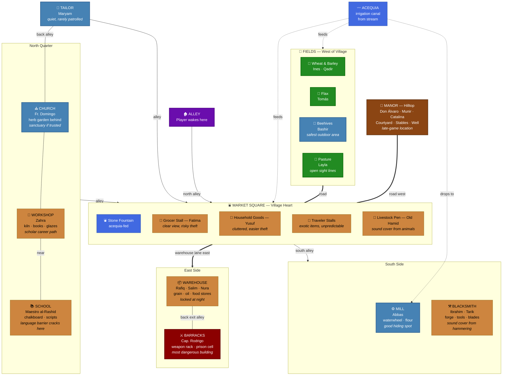

The setting is a medieval manor during the Islamic Agricultural Revolution in al-Andalus
(Muslim Spain). A walled manor house overlooks a small village and the surrounding
farmland. The architecture blends Mozarabic Christian and Andalusi Muslim styles:
whitewashed walls, terracotta roofs, horseshoe arches on the finer buildings, simple
timber framing on the rest. Water is channeled from a nearby stream through an acequia
(irrigation canal) that feeds the fields and a stone fountain in the market square.

The village is compact enough to cross in a few minutes but dense enough to hide in. Narrow
alleys connect the market square to the surrounding buildings. The player wakes in one of
these alleys.

## Market Square

The heart of the village. An open, irregular plaza paved with worn flagstone, centered on
a stone fountain fed by the acequia. Market stalls ring the edges, their canvas awnings
casting shade. This is the highest-traffic area: the most NPCs, the most eyes, and the
fastest suspicion gain. It is also where the best items are and where gifting opportunities
are richest.

The square has multiple exits: narrow alleys to the north and south, the warehouse lane to
the east, and the road to the fields and manor to the west. Sight lines are broken by the
stalls themselves, creating pockets where the player can crouch unseen if they time
movement around NPC patrol paths.

* **Grocer's stall** — Fatima's domain. The largest stall, stacked with vegetables, dried
  fruit, and grain sacks. Always busy. Fatima stands behind her counter and watches the
  crowd. Stealing here is risky because she has a clear view of most of the square.
* **Household goods stall** — Yusuf's cluttered table of pots, rope, oil lamps, and
  miscellaneous tools. Items are piled haphazardly, making theft easier than at Fatima's
  stall, but Yusuf has a habit of counting his inventory at random intervals.
* **Traveler stalls** — One or two temporary setups that rotate each week. These stalls have
  exotic items (spices, dyed cloth, foreign coins) but the travelers are unfamiliar with
  local customs and react unpredictably to the player.
* **Livestock pen** — Old Hamid's corner of the square, set slightly apart because of the
  smell. A low wooden fence holds goats, a few chickens, and occasionally a donkey. Hamid
  sits on a stool beside the pen. The animal noise provides sound cover for movement.

## Warehouse

A large, windowless mud-brick building on a lane east of the market square. The village's
grain, oil, and preserved food are stored here. A heavy wooden door is barred at night.
During the day Rafiq supervises loading and unloading while Salim and Nura haul sacks.

The warehouse is a tempting theft target because of the food supply inside, but Rafiq's
vigilance and proximity to the barracks make it dangerous. At night the door is locked
unless Salim forgot. The interior is dark, stacked with sacks and barrels, and has a back
exit that leads into an alley behind the barracks.

## Blacksmith

A sooty, open-fronted workshop on the south side of the square. The forge glows orange from
dawn to dusk. Ibrahim works the anvil while Tarik pumps the bellows or runs errands. The
clang of hammering provides sound cover. Finished tools, horseshoes, and the occasional
blade hang on the back wall.

The smithy is hot, loud, and hard to steal from because Ibrahim rarely leaves. But it is
one of the few places where the player's presence does not automatically raise suspicion:
people linger near the forge for warmth. Tarik sometimes leaves items unattended outside
when he takes deliveries around the village.

## Mill

A stone building at the edge of the village where the acequia drops enough to turn a
waterwheel. The rhythmic grinding sound carries across the square. Flour dust coats every
surface. Abbas works here alone most days, singing to himself. Sacks of grain arrive from
the fields; sacks of flour leave for the market and the warehouse.

The mill is a good hiding spot during the day because Abbas does not mind company and the
noise covers movement. At night the wheel stops and the building is empty. The miller's
quarters above the mill are small and cluttered, but he sometimes lets people sleep on the
floor by the warm stones.

## Church

A small Mozarabic chapel set back from the square on a slight rise. It is the oldest
structure in the village: rough stone walls, a low bell tower, and a single arched doorway.
The interior is dim, lit by tallow candles, with a stone altar and crude wooden benches.
A small garden behind the church grows medicinal herbs.

Father Domingo holds services for the Christian minority but keeps the door open to anyone.
The church is one of the few places where the player can rest without suspicion during the
day. At night, the door is locked from inside. If the player earns Domingo's trust, the
church becomes a potential sanctuary where guards will not enter.

## Workshop

A cluttered building adjacent to the church. The front room is Zahra's kiln and workbench,
covered in half-finished tiles, bowls, and glazes. Shelves hold geometric patterns cut
from paper, reference books in Arabic script, and jars of mineral pigments. A back room
stores finished pieces and, importantly, a small collection of books on philosophy and
natural science.

The workshop smells of clay and smoke. Zahra is absorbed in her work and does not notice
the player easily, making it one of the safer places to linger. The books in the back room
are the gateway to the scholar career path.

## Tailor

A narrow, tidy shop between two larger buildings. Bolts of linen, wool, and the occasional
silk lean against the walls. A cutting table dominates the room. Finished garments hang
from pegs. Maryam works here by lamplight, often staying late into the evening.

The tailor shop is quiet and rarely visited by guards. Maryam sometimes leaves cloth scraps
or a patched blanket where the player can find them, an early signal that not everyone in
the village is hostile. The shop has a back door into an alley that connects to the church
garden.

## Barracks

A squat, fortified building near the warehouse, identifiable by the crossed-spear emblem
painted on the door. Inside: a common room with a long table, a weapon rack, and sleeping
pallets for the guards. A small cell in the back serves as the village prison.

This is the most dangerous building in the village. Capitán Rodrigo posts the patrol
schedule on the wall inside (which Nura somehow knows). The guards rotate between market
patrol, warehouse watch, and night patrol of the alleys. Getting caught means being dragged
here. The prison cell is where the player ends up after arrest, before execution restarts
the loop.

## School

A modest single-room building with a packed-earth floor and a chalkboard propped against
the wall. Maestro al-Rashid teaches children here during the morning. By afternoon the
room empties and the teacher stays to read, write, or receive visitors.

The school is significant because al-Rashid is one of the few NPCs who might attempt
gestural communication with the player. The chalkboard and the teacher's collection of
written scripts make this a place where the language barrier can begin to crack. The
building itself is humble and guarded by nothing but social custom.

## Fields

Open agricultural land west of the village, stretching to the base of a low hill where the
manor sits. The acequia branches here into smaller channels feeding individual plots. The
fields are organized by crop:

* **Wheat and barley plots** — The largest area. Ines and other peasants work these from
  dawn to midday. The crops provide cover when tall, but after harvest the land is bare and
  exposed.
* **Flax field** — A smaller plot where Tomás processes the stalks. The retting pools where
  flax soaks give off a sharp smell. Working here is unglamorous but offers a survival path
  through honest labor.
* **Beehives** — At the eastern edge of the fields, near a stand of wildflowers. Bashir
  tends them alone. The hives are far enough from the village that guards rarely patrol here,
  making this one of the safest outdoor areas.
* **Pasture** — Rolling grassland south of the crop fields where Layla grazes the sheep. A
  low stone wall separates pasture from farmland. The pasture has clear sight lines in every
  direction, which means the player is visible but so are approaching threats.

Qadir oversees all of this with a field manager's pragmatism. He dislikes idle visitors and
will chase the player off unless they offer to work.

## Manor

A walled compound on the hill west of the fields. The walls are thick enough to resist
raiders but this is not a castle: it is a fortified country house. A wooden gate in the
wall faces the village road. Inside the walls: a courtyard with a well, the two-story manor
house, stables, a kitchen garden, and servants' quarters.

Don Álvaro lives and governs here. The manor is the seat of all authority in the area.
Munir manages the daily flow of villagers, merchants, and messengers. Catalina and other
servants move between the kitchen, the main house, and the gate. The courtyard is
semi-public during the day (villagers come to petition the lord or deliver goods), but
the house itself is private and guarded.

The manor is the late-game location. The player has no reason and no ability to enter early.
As relationships and reputation grow, the manor opens up: first the courtyard, then the
house, and eventually an audience with Don Álvaro himself.

## Village Map

**Color key:** brown = manor (late-game), green = fields, blue = safe zones (low suspicion),
gold/tan = market square and general buildings, dark red = barracks/prison (most dangerous),
purple = starting alley. The acequia flows from a stream through the fields, feeds the
market square fountain, and drops to power the mill waterwheel.